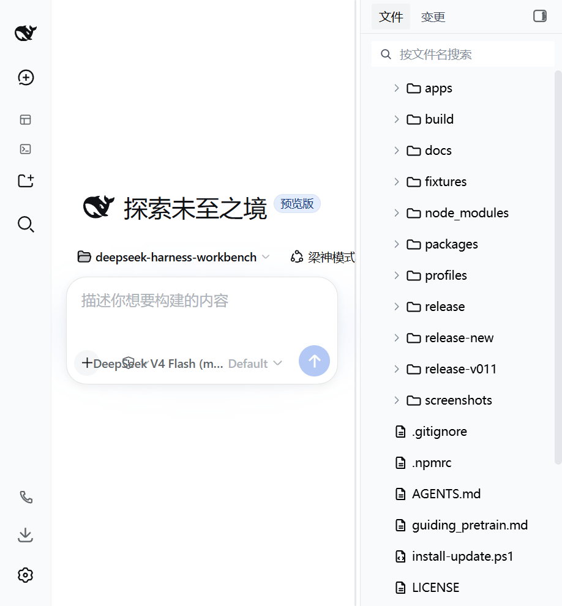
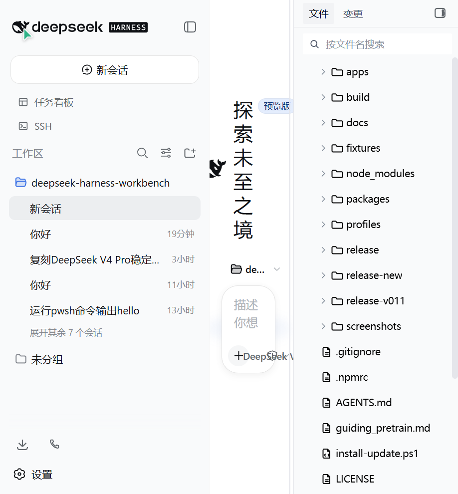

# DeepSeek Harness Workbench

> DeepSeek Harness 官方架构的 Windows 桌面发行版 —— 把官方 `dsh` Agent Harness 打包成开箱即用的桌面应用。
> 不是新的 Harness、聊天框架、插件框架或 IDE 框架；它只是官方架构的一个**桌面发行状态**（Application Carrier）。
[](https://github.com/xuan-ao-1/deepseek-harness-workbench/releases) [](LICENSE) [](https://github.com/xuan-ao-1/deepseek-harness-workbench)

## ✨ 特性

- **开箱即用**：单个安装包内置 Node.js 运行时 + 官方 `dsh`（`@deepseek-ai/dsh@0.1.0-rc.6`）+ 预生成 Profile 模板，**无需预先安装 Node/pnpm/DSH**，装完即用。
- **无边框沉浸式窗口**：Windows 完全自绘标题栏与最小化/最大化/关闭按钮（对齐 Windows 11 / TraeWork 风格），自适应浅色/深色主题。
- **官方原生 UI**：直接加载官方 `dsh-web-app` Web 界面（Phase 0 loopback），非自研聊天界面。
- **插件生态**：完整兼容官方 DeepSeek Harness 插件体系 —— 官方 DSH 插件不改版即可运行。
- **数据隔离可选**：安装版用户数据在 `~/.dsh`（与命令行 `dsh` 共享）；便携版数据在 exe 旁 `data/.dsh`（绿色携带、零残留）。
- **架构合规**：不 fork Core、不建第二套插件 API、所有能力通过官方 Profile + Bundle 组合（详见 `docs/`）。

## 🖼 界面预览

<p align="center">
  
  <br>
  <em>主界面 —— 无边框沉浸式窗口，自绘 TraeWork 风格标题栏</em>
</p>

<p align="center">
  
  <br>
  <em>侧边栏展开 —— 完整的工作区、插件与会话管理</em>
</p>

## 📥 下载

从 **Releases** 页面下载最新版：

| 版本 | 说明 |
|---|---|
| **Setup 安装版** | `DeepSeek-Harness-Workbench-x.y.z-Setup-x64.exe` —— 标准安装，创建桌面/开始菜单快捷方式，支持自定义安装目录 |
| **Portable 便携版** | `DeepSeek-Harness-Workbench-x.y.z-Portable-x64.exe` —— 绿色免安装，解压到任意目录直接运行，数据在 exe 旁，可 U 盘携带 |

> 首次启动 Portable 版需要解压（约 3-4 分钟），请耐心等待。
> 校验文件完整性请使用随 Release 附带的 `SHA256SUMS.txt`。

## 🚀 快速开始

1. 下载 **Setup** 或 **Portable** 版本并运行。
2. 启动后首次运行会从内置模板离线创建 Profile（无需网络）。
3. 在界面中配置 DeepSeek API Key（`DEEPSEEK_API_KEY` 或界面设置）。
4. 开始对话 —— 可让 Agent 读写工作区文件、执行命令、调用工具。

## 🛠 本地开发

```text
# 环境要求：Node.js >= 20, pnpm
pnpm install                      # 安装 workspace 依赖

pnpm arch:check                   # 架构守卫扫描（无需依赖，纯 Node）
pnpm -C apps/electron run build   # 编译 Electron 主进程/预加载脚本
pnpm -C apps/electron run dev     # 热重载开发（tsc watch + electronmon 自动重启）

node build/scripts/package.mjs    # 完整打包：prepare-runtime → build → NSIS/Portable + SHA256SUMS
node build/smoke-tests/smoke.mjs  # 冒烟测试（真实启动 Runtime）
```

产物输出到 `release/`：
- `DeepSeek-Harness-Workbench-<version>-Setup-x64.exe`
- `DeepSeek-Harness-Workbench-<version>-Portable-x64.exe`
- `SHA256SUMS.txt`

## 📚 文档

- [ARCHITECTURE](docs/ARCHITECTURE.md) — 当前实际架构（三层：Electron 应用 → DSH Profile → 官方 Runtime）
- [DECISIONS](docs/DECISIONS.md) — 架构决策记录（ADR）
- [STATUS](docs/STATUS.md) — 项目状态与版本矩阵
- [RELEASE](docs/RELEASE.md) — 发布政策与门槛
- [KNOWN_ISSUES](docs/KNOWN_ISSUES.md) — 已知问题
- [ROADMAP](docs/ROADMAP.md) — 路线图（M1 → M2 Official Electron Carrier）
- [UPSTREAM](docs/UPSTREAM.md) — 上游 DSH 版本 pin 与阅读结论

## 🏗 架构

```text
┌──────────────────────────────────────┐
│        Electron Application          │
│  Window / IPC / Process / Update     │
│  Frameless + self-drawn controls     │
└────────────────┬─────────────────────┘
                 ▼
┌──────────────────────────────────────┐
│             DSH Profile              │
│  dsh-base + official bundles         │
│  + workbench-desktop bundle          │
│  + user bundles + cordis.patch.yml   │
└────────────────┬─────────────────────┘
                 ▼
┌──────────────────────────────────────┐
│   Official DeepSeek Harness          │
│  Host/Client Cordis Runtime          │
│  Services / Tools / Agents           │
│  Subagents / Workflow / UI Slots     │
└──────────────────────────────────────┘
```

## 📄 License

本项目基于官方 [deepseek-ai/deepseek-harness](https://github.com/deepseek-ai/deepseek-harness)（MIT）构建，发行层亦采用 **MIT License**。详见 [LICENSE](LICENSE)。

---

**致谢**：基于 [deepseek-ai/deepseek-harness](https://github.com/deepseek-ai/deepseek-harness) 官方开源架构构建。
