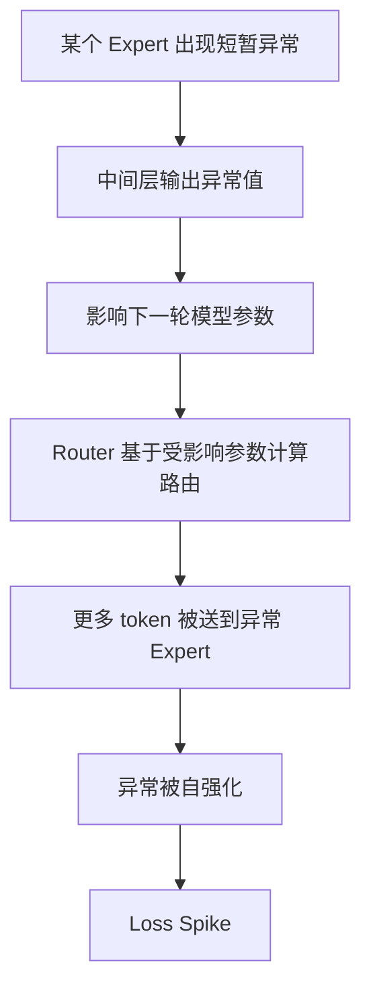
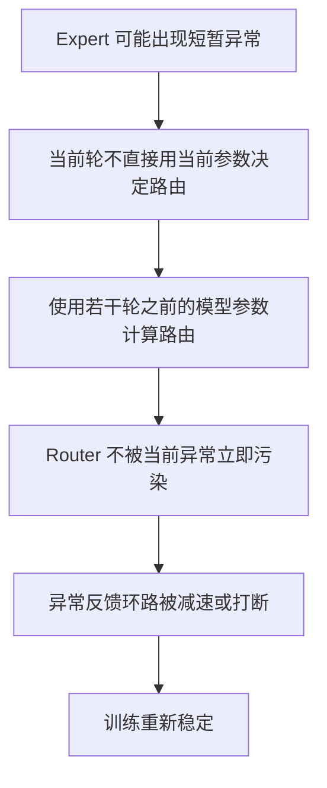

# 🌱 第 4 章 Pre-Training：预训练工程

> 在算法结构和 GPU 基础设施准备好之后，V4 在预训练过程中的各项工程处理方案

---

## 🧭 本章速览

这一章主要讨论三件事：

| 模块 | 核心问题 | 解决方案                                            |
|---|---|-------------------------------------------------|
| Data Construction | 用什么数据训练 | 数据清洗、长文档、FIM、sample-level attention mask        |
| Model / Training Setups | 怎么安排训练节奏 | Flash / Pro 差异、序列长度递进、CSA 引入时机                  |
| Training Instability | 训练不稳定怎么办 | Loss spike、Anticipatory Routing、SwiGLU Clamping |
| Evaluation | 基模效果怎么看 | 不盯分数，重点看不同 benchmark 反映的能力差异                    |


---

## 1️⃣ Data Construction：预训练数据选择和组织

DeepSeek 在 V3 预训练数据基础上，构造了一个更多样、更高质量、有效上下文更长的数据集。

最终：

- V4 Flash 数据集规模超过 **32T token**。
- V4 Pro 数据集规模超过 **33T token**。

---

## 🧹 1.1 过滤批量自动生成和模板化网页内容

报告原文提到，过滤这两类网页内容主要是为了防止 **model collapse**。

这里可以通俗理解为：

> 如果训练数据里充满 LLM 自动生成的模板化内容，模型会把这些垃圾样本当成真实世界的常见分布，最后学到失真的语言和知识结构。

这和工程里常说的 **Garbage in, Garbage out** 是一个道理。

这已经成为当前模型厂商的共识：

> 模型自己生成的大量模板化内容，会污染到模型自己的后续训练，必须做专项清洗。否则它会不停地学自己生成的质量参差不齐的内容，最后导致模型能力崩溃。

---

## 🧮 1.2 保留数学、编程、Agentic、长文档语料

DeepSeek 更重视这些语料：

- 数学语料；
- coding 语料；
- agentic data；
- long text，例如论文、技术报告等。

这里特别值得注意的是 **长文档数据**。

对长上下文训练而言，语料组织大体有两种方式：

| 方式 | 特点 | 问题           |
|---|---|--------------|
| 多段短文本拼接 | 可以快速构造长序列，提高 token 利用率 | 不同段落语义大概率不连续 |
| 原生长文本 | 逻辑自然连续，更适合训练长程依赖 | 高质量长文档语料稀缺   |

所以，从训练质量看，原生长文本当然更好；但从数据规模看，拼接 packing 仍然是广泛采用的工程手段。

> 需要注意的是，多段短文本拼接会引入额外的问题，这部分问题在后续 Sample-level Attention Mask 里会提到。

---

## 🧩 1.3 Tokenizer、Token-splitting 和 FIM

DeepSeek 沿用了 V3 tokenizer，仍保持 **128K 词表规模**。

同时加入了一些 special token，并继承了：

- token-splitting；
- FIM；
- 文档 packing 策略。

### Token-splitting：提高 tokenizer 鲁棒性

Token-splitting 可以理解为一种 tokenizer 鲁棒性训练。

DeepSeek tokenizer 中存在一些“标点 + 换行”一类的组合 token，用来提高压缩效率。但这种组合 token 也可能让模型对特定 token 边界产生偏置。

因此训练时随机拆分一部分组合 token，让模型适应多种等价切分方式，减少换行、标点、代码格式造成的边界敏感性。

### FIM：Fill in Middle

FIM 非常匹配 coding 场景。

因为在真实编码中，很多任务不是在文件尾部续写，而是在已有代码的两行之间插入一段新代码。

也就是说，训练阶段需要让模型学会：给定上文 + 给定下文 -> 生成中间内容

这比单纯“从左到右续写”更符合代码编辑任务。

还是拿 Java 的例子来举例说：

```java
/**
 * 原始代码
 */
void updateCorpHotelOrderData(XXXXBO xxxBO) {
    // 组装request
    XXXRequestType request = buildXXXRequest(xxxBO);
    
    // 调用soa接口，得到了response
    XXXResponseType response = callXXXService(request);
    
    // 把response 里的数据组装更新到数据库里
    XXXDTO xxxDTO = buildXXXDTO(response);
    xxxDAO.update(xxxDTO);
}

/**
 * 现在需要在把response数据组装更新到数据库里这一步之前，插入一段新的逻辑：查另一个接口B，把B的response也拿进来组装DTO
 */
void updateCorpHotelOrderData(XXXXBO xxxBO) {
    // 组装request
    XXXRequestType request = buildXXXRequest(xxxBO);
    
    // 调用soa接口，得到了response
    XXXResponseType response = callXXXService(request);
    
    // -> 这里就需要 LLM 插一段逻辑进来，它既需要知道上文已经有了哪些 BO 和 response，也要知道下文用哪些 BO 或者 response 来组装 DTO
    // LLM也同时还要看是不是需要把下文的代码也给改了才行，比如buildXXXDTO方法里可能也需要把B的response作为输入参数加进来。
    
    // 把response 里的数据组装更新到数据库里
    XXXDTO xxxDTO = buildXXXDTO(response);
    xxxDAO.update(xxxDTO);
}
```

---

## 🎭 1.4 Sample-level Attention Mask

训练过程中，为了提高效率，也为了组装长上下文，常常会把多段不相关文本 packing 到同一个 sequence 里训练。

但对模型来说，它不知道这些文本本来毫无关系。如果不加限制，模型可能从这些无关文本之间学出奇怪的关联。

DeepSeek 的方案是：

> **一个 batch sequence 里可以 pack 多个样本，但 attention 上限制不同 sample 之间互相看不到。**


传统 causal mask 解决的是：预测当前位置时不能看未来 token。

Sample-level attention mask 进一步解决的是：

> **不同样本虽然被工程上 pack 到一起，但语义上仍然互相隔离。**

---

## 2️⃣ Model Setups：Flash 和 Pro 的规模差异

DeepSeek V4 发布了 Flash 和 Pro 两个版本。

## ⚡ Flash

```plaintext
43 层 Transformer
总参数 284B，每 token 激活 13B
CSA top-k = 512
HCA 压缩率 = 128
MoE：1 个 shared expert + 256 个 routed experts
每 token 激活 6 个 routed experts
前两层用 dense 的 pure sliding window attention
后续层交替使用 CSA 和 HCA
```

> 更具体的模型配置参数，可以参考仓库里 `config/deepseek-v4-flash-config.json`，并辅助对照关系文档阅读。

## 🧠 Pro

```plaintext
61 层 Transformer
总参数 1.6T，每 token 激活 49B
CSA top-k = 1024
HCA 压缩率 = 128
MoE：1 个 shared expert + 384 个 routed experts
每 token 激活 6 个 routed experts
前两层直接用 HCA
后续层交替使用 CSA 和 HCA
```

> 更具体的模型配置参数，可以参考仓库里 `config/deepseek-v4-pro-config.json`，并辅助对照关系文档阅读。

## 🔍 Flash / Pro 前两层 attention 差异

两个模型在前两层注意力构造上有一个值得注意的区别：

- Flash 前两层使用 dense pure sliding window attention。
- Pro 前两层直接使用 HCA。

笔者对可能原因的推测如下，报告中没有直接说明：

1. Flash 更强调低成本，滑动窗口不需要压缩机制，也不需要配套工程处理。
2. HCA 更像粗粒度全局背景，DeepSeek 可能认为对 Flash 而言，近处的稠密注意力更重要，低层没有必要太早建立全局注意力的机制。这里可能是DS对Flash和Pro的定位不同而做的工程处理，Flash更倾向于优先理解近处上下文，而Pro更倾向于从一开始就建立全局感觉。
3. Sliding window attention 是稠密且相对简单的，对 Flash 的训练稳定性更友好。

---

## 3️⃣ Training Setups：训练节奏

报告原文把这部分放在 4.2 Model Setups 下面，主要讲三件事。

## 🧰 3.1 优化器组合：AdamW + Muon

Flash 和 Pro 采用相同策略：

- 大多数参数使用 **Muon**。
- embedding、prediction head、所有 RMSNorm 权重使用 **AdamW**。

这体现了一个工程取舍：

> 主要矩阵参数使用 Muon 来提升收敛和稳定性，但敏感参数仍然保留传统 AdamW。

## 📏 3.2 递进的序列长度

Flash 和 Pro 都支持 1M context，但训练不是一开始就直接上 1M。

而是递进式扩展：

```plaintext
4K -> 16K -> 64K -> 1M
```

这很好理解：从零开始训练的模型不可能一开始就读 1M context，就像不可能直接让婴儿读四大名著。

## 🧭 3.3 Sparse Attention 的引入时机

这部分可以理解为：DeepSeek 选择在训练什么阶段真正引入 CSA。

### Flash 的策略

- 前 1T tokens 使用 dense attention warmup。
- 序列长度扩大至 64K 时引入 CSA。
- 引入 CSA 时，先短暂 warmup CSA indexer。
- 然后进入大部分 sparse attention 训练。

### Pro 的策略

Pro 与 Flash 类似，但 dense attention 阶段更长。

## ✅ 训练节奏的意义

1. 稠密注意力的基座打底过程必不可少，先在较短文本上学稳定 token 表示和分布，再引入压缩与筛选。
2. CSA indexer 不是一开始就会选择，它需要先从稳定 attention 分布里学习怎么筛选。过早引入 CSA，可能让模型训练早期就走错路。

---

## 4️⃣ Mitigating Training Instability：训练稳定性问题

DeepSeek 在报告中提到，训练过程中遇到了 **loss spike** 问题。 回滚可以暂时恢复，但不能阻止 spike 再次发生。

## 📈 什么是 loss spike

训练的本质，是不断降低模型预测结果与标签之间的差异，这个差异通常用 loss 衡量。

正常训练中，loss 应该总体下降。

而 **loss spike** 是指：

> 本来逐步下降的 loss 中，突然出现显著上扬的尖峰。

这个尖峰可能后续自动消失，也可能直接把训练带崩。


---

## 🔁 4.1 Anticipatory Routing

DeepSeek 从经验角度发现：spike 和 MoE 层里的异常值绑定，而 expert routing 机制似乎会加剧异常值出现。

异常反馈环路可以简化为：



DeepSeek 的解决方案是打破这个环路：



需要强调的是：

> DeepSeek 不是在所有训练中都使用 Anticipatory Routing，而是在 loss spike 发生后，先回滚，再开启 Anticipatory Routing，维持一段时间后，再回到正常训练行为。

---

## ✂️ 4.2 SwiGLU Clamping

如果把 Anticipatory Routing 类比成后端系统里的熔断、回滚、降级、恢复，那么 SwiGLU Clamping 更像是数值稳定性的提前限流。

它的思路不是等异常反馈环路形成后再处理，而是在 FFN 的关键中间变量上直接限幅，防止异常激活值继续放大和扩散。

### SwiGLU 是什么

可以简化理解为：

- SwiGLU 是 Transformer 中常见的门控激活结构。
- 它用来决定哪些信息应该被放大、哪些信息应该被抑制。
- SwiGLU 里存在一个乘法门控结构。
- 某个分支如果偶发出现极端大值，和另一个分支相乘后可能进一步放大，形成异常值。

### Clamping 的作用

既然这些异常值可能污染后续计算，那直接限幅是一个非常工程化的处理方式。

报告原文中设置阈值为 **[-10, 10]**：超过阈值的值直接截断。

这样即使中间变量偶发异常，也会被截断在可控范围内，降低异常值扩散并诱发 loss spike 的概率。

## ⚠️ 工程上的经验化方案

报告中也提到，这两个方案不是严谨的数学优化，而是经验化工程方案。

也就是说：

- 原因归纳是经验式的；
- 不是完整数学推导；
- 但工程上被证明有效。
- 知道有用